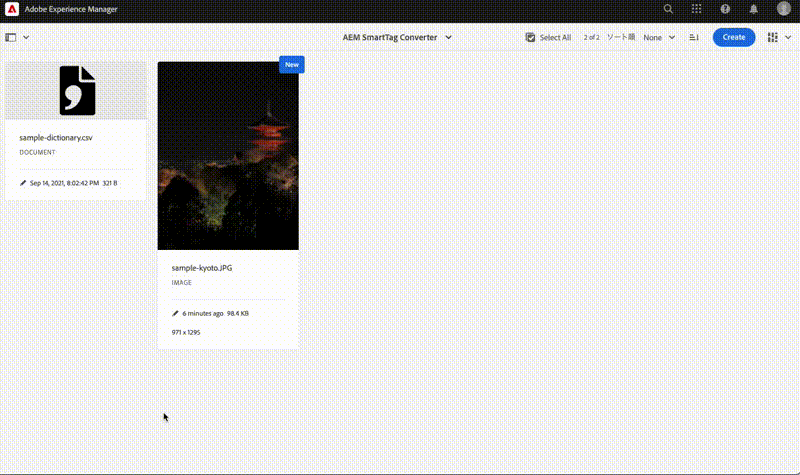

# AEM Smart Tag Converter

Sometime AEM user wants to convert smart tags which are attached by AEM into other tags.
e.g
 cousin -> cooking
 sky -> 空

This AEM workflow process can convert smart tags into other tags.
The conversion rule is defined in CSV dictionary file in Assets.
This is also useful for smart tag translation.

Sample dictionary is /content/dam/aem-smarttag-converter/sample-dictionary.csv.

Demo:

## Modules

The main parts of the project are:

* core: Java bundle containing all core functionality like OSGi services, listeners or schedulers, as well as component-related Java code such as servlets or request filters.
* it.tests: Java based integration tests
* ui.content: contains sample content using the components from the ui.apps
* ui.config: contains runmode specific OSGi configs for the project
* all: a single content package that embeds all of the compiled modules (bundles and content packages) including any vendor dependencies
* analyse: this module runs analysis on the project which provides additional validation for deploying into AEMaaCS

## How to build

To build all the modules run in the project root directory the following command with Maven 3:

    mvn clean install

To build all the modules and deploy the `all` package to a local instance of AEM, run in the project root directory the following command:

    mvn clean install -PautoInstallSinglePackage

Or to deploy it to a publish instance, run

    mvn clean install -PautoInstallSinglePackagePublish

Or alternatively

    mvn clean install -PautoInstallSinglePackage -Daem.port=4503

Or to deploy only the bundle to the author, run

    mvn clean install -PautoInstallBundle

Or to deploy only a single content package, run in the sub-module directory (i.e `ui.apps`)

    mvn clean install -PautoInstallPackage

## Testing

There are three levels of testing contained in the project:

### Unit tests

This show-cases classic unit testing of the code contained in the bundle. To
test, execute:

    mvn clean test

